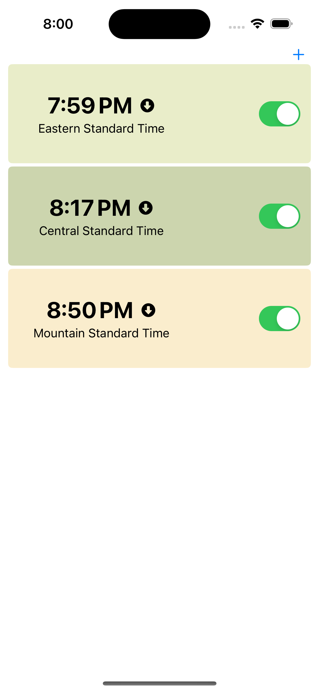
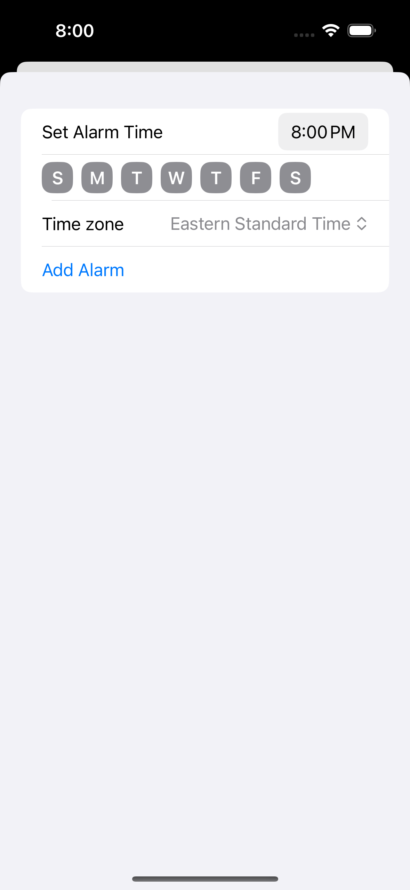

# Sycamore-iOS
A iOS alarm clock imagined for travelers

## Who Needs This?
I created this alarm app for travels who often find themselves having to set multiple alarms depending on the timezone their in. Whether you're a Californian coming to the east coast an having to set an alarm three hours ahead to make sure you don't miss anything. Or a Tennessean driving across the state and forgetting to set your alarm for an hour earlier when you hit central time.

## How Does It Work?
Sycamore has a simplistic UI that allows you to set your alarm and current time-zone (currently US only) and regardless of your location you'll receive it at the correct time. This means your 2:30PM meeting alarm you set on the east coast will go off at 11:30AM while you're visiting family on the west coast.

## What Does It Look Like?

## Have a Feature Request?
Just open an issue (here)[https://github.com/Squidonomics/Sycamore-iOS/issues] and I'll see if it's something I can add!